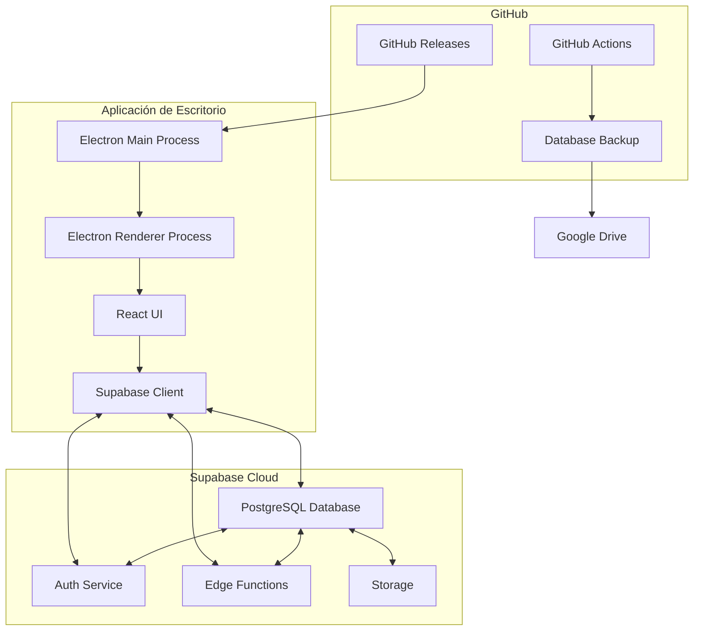

# Arquitectura del Sistema POS SpinHunters

Este documento describe la arquitectura del sistema POS SpinHunters, incluyendo los componentes principales y sus interacciones.

## Diagrama de Arquitectura

## Componentes Principales

### Aplicación de Escritorio

- **Electron Main Process**: Gestiona la ventana de la aplicación, las actualizaciones automáticas y las operaciones del sistema de archivos.
- **Electron Renderer Process**: Ejecuta la interfaz de usuario React.
- **React UI**: Interfaz de usuario construida con React y Ant Design.
- **Supabase Client**: Cliente JavaScript que se comunica con los servicios de Supabase.

### Supabase Cloud

- **PostgreSQL Database**: Almacena todos los datos de la aplicación (usuarios, membresías, transacciones, etc.).
- **Auth Service**: Gestiona la autenticación y autorización.
- **Edge Functions**: Funciones serverless para operaciones como exportación de datos.
- **Storage**: Almacenamiento de archivos (no utilizado actualmente, pero disponible para futuras expansiones).

### GitHub

- **GitHub Releases**: Almacena las versiones de la aplicación para las actualizaciones automáticas.
- **GitHub Actions**: Automatiza el proceso de construcción, publicación y copias de seguridad.

### Google Drive

- Almacena las copias de seguridad diarias de la base de datos.

## Flujo de Datos

1. La aplicación de escritorio se conecta a Supabase Cloud a través del cliente Supabase.
2. Los datos se sincronizan en tiempo real mediante WebSockets cuando es posible.
3. Las operaciones de escritura se realizan a través de la API REST de Supabase.
4. Las copias de seguridad se realizan diariamente mediante GitHub Actions y se almacenan en Google Drive.
5. Las actualizaciones de la aplicación se comprueban al inicio y se descargan automáticamente desde GitHub Releases.

## Seguridad

- La aplicación utiliza la clave anónima de Supabase, pero las operaciones están limitadas por las políticas de Row Level Security (RLS).
- Las operaciones privilegiadas (como las copias de seguridad) utilizan la clave de servicio, que solo está disponible en el entorno de CI/CD.
- La comunicación con Supabase se realiza a través de HTTPS.

## Extensibilidad

La arquitectura está diseñada para permitir futuras integraciones:

- Integración con WordPress (Ultimate Member)
- Integración con sistemas de aprendizaje (Classroom)
- Integración con Discord
- Aplicaciones móviles que lean de la misma base de datos